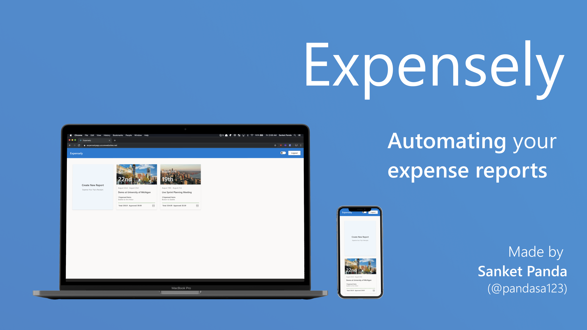

# Expensely Auto Expenser



[](https://dev.azure.com/Expensely/MyFirstProject/_build/latest?definitionId=4&branchName=master)

**Live Demo**: https://expenselyapp.azurewebsites.net/

**Video Demo**: https://www.youtube.com/watch?v=vHKd9PtlToU&feature=youtu.be

## Overview

Using Microsoft Azure, AI / ML, Expensely hopes to expedite the expensing process for account managers and employees alike.

**For Employees trying to expense a trip's receipts:**

- Automatically collect and file an entire trip's receipts
- Introduce explainability to understand why an item wasn't approved
- Provide transparency in current expense case statuses

**For Account Managers reviewing expense reports:**

- Integrate AI to automate review receipts
- Specify company expensing policies during receipt reviews
- Reduce time and increase reliability for expense report reviews

## The Story

One fateful day, my colleagues and I woke up at 4AM for our flight from Austin to New York. We got to the airport at 6AM and bought some breakfast before our 8AM flight. We boarded and then the crew realised they had a malfunctioning plane and had us deplane. Delay after delay, we decided to get lunch, snacks, etc.

We were cranky and tired and we realised that we didn't want to enter _every single item we bought_ into our expense reports. It's just so much work! We joked around a bit about how nice it'd be if there was _an automated expensing solution_?

We just upload our receipts and some basic information and it'd automatically pull our company's expensing policy so we'd know instantaneously how much our company would approve etc rather than manually typing everything, making mistakes, spending so much time for such a simple process, and then wait days for our expense reports to be approved. That's absolute madness!

So, here's the answer to this problem: **Expensely**, a solution built with Microsoft Azure's Cloud and AI/ML capabilities, as well as Microsoft's Fabric design language!

## Architecture


**Cloud Architecture**

- Azure App Services: Scalable, containerised front-end
- Azure Functions: Serverless, polyglot FaaS backend with federated access management
- Bing Search API: REST-ful Image Search
- Azure Active Directory B2C: Identity Access Management
- Azure Cognitive Services: Natural Language Understanding service for entity extraction
- Azure Form Recognizer: Managed Computer Vision service to extract data from images
- Azure Blob Storage: Scalable unstructured data storage for image data
- Azure Table Storage: Flexible NoSQL database
- Azure DevOPs: CI/CD

## Build and Run Frontend

```bash
cd expensely-frontend
yarn install
yarn start
```

## Frontend

I love React and Typescript. It was a quick decision for my frontend stack. Since I was building my entire Cloud / AI / ML solution using solely Microsoft technology, I felt it'd be fitting if I designed my frontend to follow Microsoft's beautiful Fabric design language. Though there are a few custom components, I tried to stay as close to the Fabric guidelines as I could

## Backend / Cloud

I believe that serverless Azure Functions is a sensible, scalable architecture decision since I don't know what type of load I'll be receiving. We have a few API routes in our app:

- Our Dashboard view calls upon a function that fetches a user's trips from Azure Table Storage as well as calls the Bing Image Search API to pick out a delightful image of the trip's main location
- Our New Report View has a multi-step process. First, we upload the image to Azure Blob Storage. Then, we analyse the image with Form Recognizer (Preview) and fetch the company's policies from Azure Table Storage. After we have the image data and company policy data, we review the image based on the company's policies and store the result back in the user database

Along with APIs, I used Azure Active Directory B2C for Identity Management. Very straightforward and well designed

## Cognitive / AI / ML Aspect

I used Azure Cognitive Services for various aspects of Expensely. First, on the Dashboard view, we have Bing Image Search API for image retrieval. On the New Report view, we have Form Recognizer as our Computer Vision engine to analyse images and extract data. For Policy Review, companies can approve / reject items with NLU keywords

## Finishing Off

There's a lot left to do. Next steps:

- Formally add NLU
- Refine CV output
- Clean up Azure Functions by introducing bindings
- Secure endpoints

I loved working on Expensely up until now and I'm looking forward to keep working on this in the future! Thank you for reading about my project and I hope you enjoyed it as much as I loved building it!

## Related Resources

- [ZenHub board](https://app.zenhub.com/workspaces/expense-ly-5d5044f23cb7066481260b1d/board?repos=201786565) (invitation required)
- [Azure AI Hackathon](https://azureai.devpost.com)
